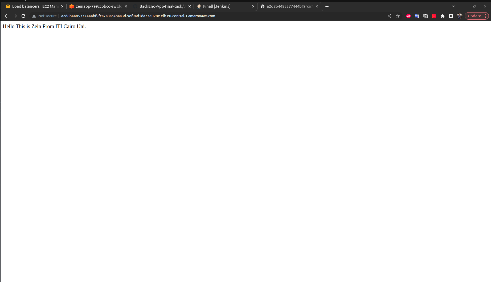
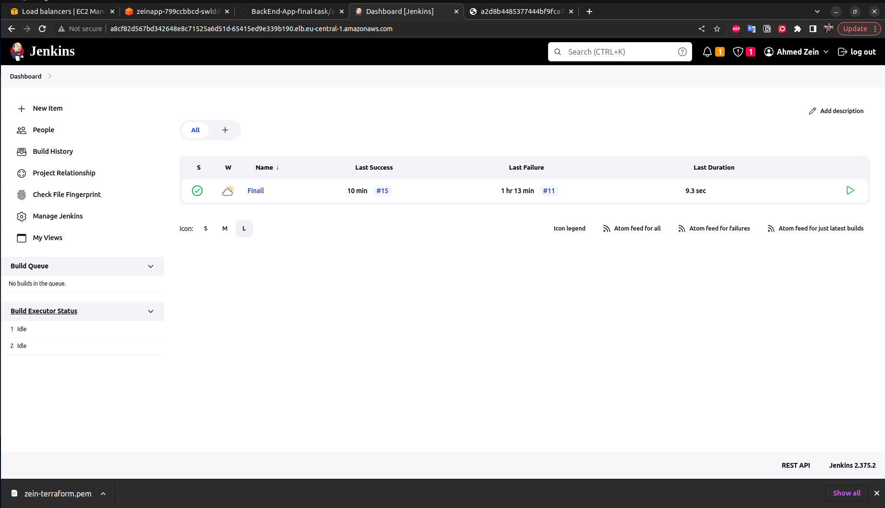

# Infrastructure to create EKS cluster in aws private with Terraform

## Introduction

###   This guide provides instructions on how to set up an EKS cluster in AWS using Terraform and accessing the cluster through a bastion instance. Additionally, this guide includes instructions on how to use Ansible to configure to install AWS cli and Kubectl and copy the jenkinss and the necessary K8S yaml files  

## Prerequisites

Before you begin, you will need the following:

- An AWS account
- Terraform installed on your local machine
- Ansible installed on your local machine

## Cloning Jenkins CI/CD repo

1. Open a terminal or command prompt on your local machine.
2. Change the current working directory to the desired location where you want to clone the repo.
3. Run the following command to clone the Jenkins CI/CD repo to your local machine:
```bash
git clone https://github.com/AhmedZeins/Final-Task-Using-AWS.git
```

## Building Infrastructure with Terraform

1. Open a terminal or command prompt on your local machine.
2. Change the current working directory to the root directory of the cloned Jenkins CI/CD repo.
3. Run the following command to initialize Terraform:
```bash
terraform init
```

4. Run the following command to see if there are any issues with the infrastructure:
```bash
terraform plan
```

5. If the plan looks good, run the following command to build the infrastructure:

```bash
terraform apply
```

## Installing AWS cli and copy the Yaml files  using  Ansible Playbook

1. Open a terminal or command prompt on your local machine.
2. Change the current working directory to the root directory of the cloned Jenkins CI/CD repo.
3. Run the following command to run the Ansible playbook:

```bash
ansible-playbook -i inventory.txt playbook.yml
```
## Install Kubectl Using Ansible

1. Open a terminal or command prompt on your local machine.
2. Change the current working directory to the root directory of the cloned Jenkins CI/CD repo.
3. Open the `inventory.txt` file and add your machine's IP address to the list.
4. Run the following command to install Kubernetes using Ansible:

```bash
ansible-playbook -i inventory.txt install-k8s.yml

```

## Accessing EKS Cluster

1. Open a terminal or command prompt on your local machine.
2. Change the current working directory to the root directory of the cloned Jenkins CI/CD repo.
3. Run the following command to configure kubectl:
```bash
aws eks --region <region-name> update-kubeconfig --name <cluster-name>
```

4. Replace `<region-name>` with the AWS region where your EKS cluster is deployed and `<cluster-name>` with the name of your EKS cluster.

5. Run the following command to verify that you can connect to the EKS cluster:
```bash
kubectl get nodes
```

## Applying Jenkins YAML files

1. Change the current working directory to the `Jenkins` directory.
2. Run the following command to apply the Jenkins deployment YAML file:
```bash
kubectl apply -f namespace.yaml
kubectl apply -f serviceAccount.yaml
kubectl apply -f service.yaml
kubectl apply -f deployment.yaml
```

These YAML files will create a Kubernetes deployment for Jenkins, as well as a load balancer service, service account, and cluster roles and bindings.


### Accessing the Load Balancer

1. Open the AWS Management Console and navigate to the EC2 service.
2. In the left navigation pane, click on "Load Balancers".
3. Select the load balancer for the Jenkins service.
4. In the "Description" tab, copy the value of the "DNS name" field.

   This DNS name is the URL for accessing the Jenkins service.

5. Open a web browser and paste the DNS name into the address bar.

## Configuring Jenkins

1. Once logged in to Jenkins, click on "Manage Jenkins" in the left navigation pane.
2. Click on "Configure credentials".
3. Add your Github credentials.
4. 
   These credentials should be personal access token with "repo" and "admin:repo_hook" scopes.

5. Repeat step 2 again.
6. Click on "Add Credentials" to add your Docker credentials.

   These credentials should be a username and password for your Docker registry.

## Creating Jenkins Pipeline

1. In Jenkins, click on "New Item" in the left navigation pane.
2. Enter a name for the pipeline, and select "Pipeline" as the type.
3. Click on "OK" to create the pipeline.
4. Select pipeline script from SCM
5. Choose git in SCM tab 
6. Add your github repo link 
7. choose your credentials for github
8. Save you pipeline and the click on Build Now 

The Jenkins file I'm using :
```grovy


pipeline {
    agent any

    stages {
        stage('CI') {
            steps {
                git url: 'https://github.com/AhmedZeins/BackEnd-App-final-task.git' , branch: 'main'
                withCredentials([usernamePassword(credentialsId: 'Docker', usernameVariable: 'USERNAME', passwordVariable: 'PASSWORD')]) {
                sh """
                docker login -u ${USERNAME} -p ${PASSWORD}
                docker build . -t zeinsss/app:v1.1 --network host
                docker push zeinsss/app:v1.1
                """
                }
            }
        }
         stage('CD') {
            steps {
                withCredentials([usernamePassword(credentialsId: 'Docker', usernameVariable: 'USERNAME', passwordVariable: 'PASSWORD')]) {
                sh """
                ls
                docker login -u ${USERNAME} -p ${PASSWORD}
                kubectl apply -f /var/jenkins_home/workspace/Finall/NS.yaml
                kubectl apply -f /var/jenkins_home/workspace/Finall/app.yaml
                kubectl apply -f/var/jenkins_home/workspace/Finall/lba.yaml
                """
                }
            }
        }
    }
}
```

## App Up and Running : 
## [ App link ](http://a2d8b4485377444bf9fca7a8ac4b4a3d-9ef94d1da77e028e.elb.eu-central-1.amazonaws.com/)



## Jenkins Up and Running 
## [ Jenkins link ](http://a8cf82d567bd342648e8c71525a6d51d-65415ed9e339b190.elb.eu-central-1.amazonaws.com/)


---


